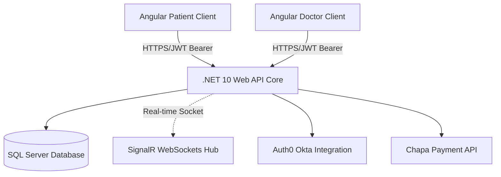
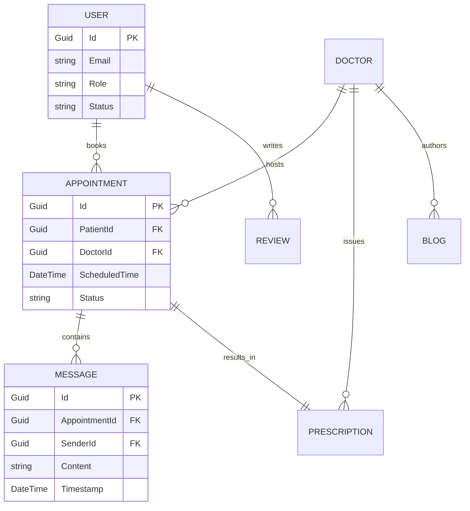

# 🏥 Med-Connect: Ethiopia's Integrated Healthcare Platform

## 🌟 1. Project Overview & Scope
**Med-Connect** is a comprehensive, production-grade digital health ecosystem designed and developed as a final year capstone project. Its primary goal is to modernize healthcare delivery in Ethiopia by bridging the gap between patients and verified medical professionals. The platform facilitates real-time scheduling, safe data management, peer-reviewed medical insights, and telemedicine capabilities through real-time communication.

---

## 📋 2. System Requirements

### A. Functional Requirements
- **User Management:** Registration, login, and profile management for Patients, Doctors, and Admins.
- **Appointment Management:** Search doctors by specialty, view availability calendars, book, reschedule, or cancel appointments.
- **Telemedicine & Chat:** Real-time text consultation triggered securely only during active booked appointment slots.
- **Medical Records:** Doctors must be able to issue and attach immutable digital prescriptions to a patient's portfolio.
- **Financial Processing:** Secure Checkout using the local Chapa Gateway.
- **Knowledge Sharing:** Verified doctors can post medical blogs, which users can read, like, and comment on.

### B. Non-Functional Requirements
- **Security:** All connections must be HTTPS; endpoints must strictly enforce JWT authentication and Role-Based Access Control (RBAC).
- **Performance:** System must handle parallel database queries via `async/await` and Angular UI must utilize lazy loading to guarantee fast metrics under load.
- **Reliability:** Real-time communication must gracefully fallback if WebSockets disconnect (achieved natively via SignalR).

---

## 🏗️ 3. Detailed Project Features and Modules
The project is divided into highly cohesive modules targeting specific business domains:

### 📅 A. Unified Appointment Engine
- **Doctor Discovery:** Advanced filtering system powered by EF Core link.
- **Scheduling System:** Automated calendar mapping to avoid overlapping schedules.
- **Payment Integration:** Integrated **Chapa Payment Gateway** for seamless local currency transactions.

### 💬 B. Telemedicine Real-Time Chat Integration
- **Context-Aware Live Consultation:** A chat interface via SignalR tying messages directly to unique Appointment IDs.
- **Read Receipts & History:** Conversation persisting over an advanced database schema.

### 🏥 C. Medical Records & Prescriptions
- **Digital Prescriptions:** Generating secure digital medication slips tied to the patient database.
- **Reviews & Feedback:** Star-rating testimonial implementation ensuring accountability.

### 📚 D. Knowledge Hub (Blog System)
- **Medical Articles:** A secure blogging pipeline where doctors share insights.
- **Community Engagement:** Real-time feedback via Likes, Comments, and Flags.

---

## 📐 4. System Architecture & Design

Med-Connect utilizes a **Decoupled Client-Server Architecture** adhering to Domain-Driven Design (DDD) principles. 

- **Presentation Layer (Client):** The Angular 21 SPA consumed by the browser. Manages local UI states.
- **Business Logic Layer (Server):** The ASP.NET 10 Web API handling validation, mapping, payments, and serving as the SignalR Hub.
- **Data Access Layer:** Entity Framework Core bridging C# model classes to the persistent SQL Tables.

### API Communication & Fetching Strategy
The Angular frontend communicates with the .NET backend using a heavily abstracted RESTful approach over HTTP:
- **HttpClient:** Used to execute asynchronous CRUD operations (`GET`, `POST`, `PUT`, `DELETE`).
- **RxJS Observables:** Responses are mapped into reactive data streams, allowing the UI to subscribe to data changes smoothly and handle loading states natively.
- **Interceptors:** An Angular HTTP Interceptor automatically intercepts outgoing API requests and seamlessly attaches the secure Auth0 JWT `Bearer` token to the Authorization headers.



---

## 🗄️ 5. Database Schema & Entities

The platform relies on a highly normalized relational schema to avoid data anomalies, particularly for medical records.



---

## 🛠️ 6. Tool Selection and Tech Stack
We carefully evaluated several technologies and settled on an Enterprise-grade stack to ensure scalability and maintainability.

### A. Core Languages & Frameworks
- **Frontend:** Angular (v21) & TypeScript. Superior component architecture and RxJS streams. Styled heavily with Bootstrap 5 & SCSS.
- **Backend:** C# & .NET 10 Web API. Extremely fast, robust Dependency Injection, and natively secure endpoints.
- **Database:** Microsoft SQL Server governed by Entity Framework Core 10 ORM.

### B. External Integrations & Dev Tools
- **Auth0 by Okta:** Abstracts password hashing and issues stateless JWTs.
- **Chapa Payment Gateway:** Local currency processing and automated receipt verification.
- **SignalR:** Prevents HTTP polling by managing persistent WebSocket channels for Chat.
- **Postman:** Extensively used throughout the API design and unit testing lifecycle.

---

## 🧪 7. Comprehensive Testing Strategy
To ensure maximum reliability in a healthcare context, we established a tiered testing approach:

### 1. Unit Testing
- **Backend:** We isolate core C# Services and business logic. We utilize **xUnit** as the test runner and **Moq** to inject mock repositories, proving our logic works without needing a live SQL Database.
- **Frontend:** **Vitest** and **Jasmine** verify that Angular components parse data variables accurately.

### 2. Integration Testing
- We simulate combinations of layers. Using an **In-Memory EF Core Database**, we test API endpoint routes to ensure AutoMapper and FluentValidation correctly construct and deny payloads respectively.
- **Postman Test Scripts** are used to assert HTTP status codes (e.g., verifying `401 Unauthorized` triggers appropriately for unprotected routes).

### 3. System & E2E Testing
- End-to-End manual tracking of user journeys: Setting up an account, funding a mock Chapa transaction, engaging in a 2-way real-time chat, generating a mock prescription, and reading from the SQL dashboard. 

---

## 🔄 8. Core System Workflows
    
### 🏥 A. Appointment Booking & Payment Flow
1. **Discovery:** Patient logs in, searches for a doctor, and reviews available slots.
2. **Selection:** Patient selects an available date/time slot.
3. **Checkout:** Routed to **Chapa Gateway** to settle the fee.
4. **Confirmation:** Backend verifies the Chapa webhook/receipt, changes the status to `Scheduled`, and alerts the doctor.

### 💬 B. Telemedicine Chat Flow
1. **Verification:** The `Chat` interface strictly unlocks in the UI at the appointment hour.
2. **Connection:** Establishing a secure **SignalR WebSocket** connection tied exclusively to `AppointmentId`.
3. **Session:** The doctor and patient consult in real-time. History persists in SQL.
4. **Completion:** Doctor finalizes the appointment and conditionally attaches a digital prescription.

### 👤 C. User Registration & Onboarding Flow
1. **Sign Up:** A new user selects their role (Patient or Doctor), inputs their profile details, and submits the form.
2. **Identity Creation:** The credentials are securely pushed to the **Auth0** identity provider for hashing and token generation.
3. **Database Sync:** The API intercepts the success callback and generates a corresponding internal profile mapped to the `Auth0 Subject ID` in the SQL Database.
4. **Role Assignment:** Patients gain immediate access to the platform, whereas Doctors are flagged with an unverified status allowing limited access until credentials are administratively reviewed.

---

## 🚀 9. Deployment Strategy & Infrastructure
*Proposed CI/CD methodology for bringing the application out of localhost:*
- **Frontend Hosting:** The built Angular static files can be deployed to CDN edges like **Vercel** or **Firebase Hosting**.
- **Backend Hosting:** Containerizing the .NET Web API and deploying to **Azure App Services** for geographic load balancing.
- **Database Hosting:** Migrating the SQL schema to **Azure SQL Database** ensuring automated daily backups and data redundancy.

---

## 🔧 10. Maintenance & Future Scope
### Maintenance Protocol
- **Log Monitoring:** Backend errors and critical system failures are tracked dynamically using **Serilog**.
- **Security Updates:** Rolling patches for Nuget and npm packages via GitHub dependabot.

### Future Enhancements
- WebRTC integration for Live Video Consultation.
- Machine Learning analysis for initial symptom checking before matching to a doctor.
- Expanding automated pharmacy delivery services tied to digital prescriptions.

---

## 🏁 11. Quick Start for Examiners/Developers
### Prerequisites
- [Node.js](https://nodejs.org/) (v20+) & [.NET SDK](https://dotnet.microsoft.com/download) (v10.0+)
- SQL Server

### Backend Setup
```bash
cd BackendAPI
dotnet restore
dotnet ef database update
dotnet run
```

### Frontend Setup
```bash
cd Frontend
npm install
npm start
```

---

## 🤝 12. Project Team
- **Development & Research:** Final Year Capstone Team (Ethiopia)
- **Status:** Complete Delivery & Production Phase
- **Email:** medconnect271@gmail.com

---
*Developed with Passion & Purpose for Healthier Communities — Combining modern technology with critical healthcare infrastructure.*
