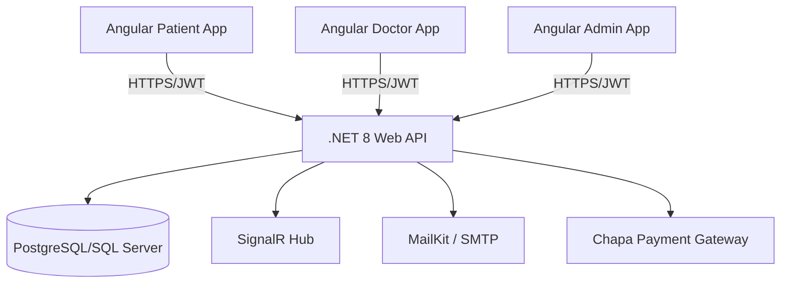

▲ [WARNING] NG8113: RouterLink is not used within the template of BlogListComponent [plugin angular-compiler]

    src/app/features/blog/pages/blog-list/blog-list.component.ts:9:28:     
      9 │     imports: [CommonModule, RouterLink],
        ╵                             ~~~~~~~~~~


X [ERROR] TS2307: Cannot find module '../../../../core/services/doctor-search.service' or its corresponding type declarations. [plugin angular-compiler]

    src/app/features/appointments/pages/book-appointment/book-appointment.component.ts:7:36:
      7 │ ...chService } from '../../../../core/services/doctor-search.service';
        ╵                     ~~~~~~~~~~~~~~~~~~~~~~~~~~~~~~~~~~~~~~~~~~~~~~~~~


X [ERROR] TS2571: Object is of type 'unknown'. [plugin angular-compiler]   

    src/app/features/appointments/pages/book-appointment/book-appointment.component.ts:57:4:
      57 │     this.doctorService.getDoctorById(id).subscribe({
         ╵     ~~~~~~~~~~~~~~~~~~


X [ERROR] Could not resolve "../../../../core/services/doctor-search.service"

    src/app/features/appointments/pages/book-appointment/book-appointment.component.ts:7:36:
      7 │ ...chService } from '../../../../core/services/doctor-search.service';
        ╵                     ~~~~~~~~~~~~~~~~~~~~~~~~~~~~~~~~~~~~~~~~~~~~~~~~~


Application bundle generation failed. [1.409 seconds] - 2026-05-04T10:23:50.436Z

▲ [WARNING] NG8113: RouterLink is not used within the template of BlogDetailComponent [plugin angular-compiler]

    src/app/features/blog/pages/blog-detail/blog-detail.component.ts:12:28:      12 │     imports: [CommonModule, RouterLink, FormsModule],
         ╵                             ~~~~~~~~~~


▲ [WARNING] NG8113: RouterLink is not used within the template of BlogListComponent [plugin angular-compiler]

    src/app/features/blog/pages/blog-list/blog-list.component.ts:9:28:     
      9 │     imports: [CommonModule, RouterLink],
        ╵                             ~~~~~~~~~~


X [ERROR] TS2307: Cannot find module '../../../../core/services/doctor-search.service' or its corresponding type declarations. [plugin angular-compiler]

    src/app/features/appointments/pages/book-appointment/book-appointment.component.ts:7:36:
      7 │ ...chService } from '../../../../core/services/doctor-search.service';
        ╵                     ~~~~~~~~~~~~~~~~~~~~~~~~~~~~~~~~~~~~~~~~~~~~~~~~~


X [ERROR] TS2571: Object is of type 'unknown'. [plugin angular-compiler]   

    src/app/features/appointments/pages/book-appointment/book-appointment.component.ts:57:4:
      57 │     this.doctorService.getDoctorById(id).subscribe({
         ╵     ~~~~~~~~~~~~~~~~~~


X [ERROR] Could not resolve "../../../../core/services/doctor-search.service"

    src/app/features/appointments/pages/book-appointment/book-appointment.component.ts:7:36:
      7 │ ...chService } from '../../../../core/services/doctor-search.service';
        ╵                     ~~~~~~~~~~~~~~~~~~~~~~~~~~~~~~~~~~~~~~~~~~~~~~~~~


Application bundle generation failed. [0.634 seconds] - 2026-05-04T10:27:02.741Z

▲ [WARNING] NG8113: RouterLink is not used within the template of BlogDetailComponent [plugin angular-compiler]

    src/app/features/blog/pages/blog-detail/blog-detail.component.ts:12:28:      12 │     imports: [CommonModule, RouterLink, FormsModule],
         ╵                             ~~~~~~~~~~


▲ [WARNING] NG8113: RouterLink is not used within the template of BlogListComponent [plugin angular-compiler]

    src/app/features/blog/pages/blog-list/blog-list.component.ts:9:28:     
      9 │     imports: [CommonModule, RouterLink],
        ╵                             ~~~~~~~~~~


X [ERROR] TS2307: Cannot find module '../../../../core/services/doctor-search.service' or its corresponding type declarations. [plugin angular-compiler]

    src/app/features/appointments/pages/book-appointment/book-appointment.component.ts:7:36:
      7 │ ...chService } from '../../../../core/services/doctor-search.service';
        ╵                     ~~~~~~~~~~~~~~~~~~~~~~~~~~~~~~~~~~~~~~~~~~~~~~~~~


X [ERROR] TS2571: Object is of type 'unknown'. [plugin angular-compiler]   

    src/app/features/appointments/pages/book-appointment/book-appointment.component.ts:57:4:
      57 │     this.doctorService.getDoctorById(id).subscribe({
         ╵     ~~~~~~~~~~~~~~~~~~


X [ERROR] Could not resolve "../../../../core/services/doctor-search.service"

    src/app/features/appointments/pages/book-appointment/book-appointment.component.ts:7:36:
      7 │ ...chService } from '../../../../core/services/doctor-search.service';
        ╵                     ~~~~~~~~~~~~~~~~~~~~~~~~~~~~~~~~~~~~~~~~~~~~~~~~~


Application bundle generation failed. [0.687 seconds] - 2026-05-04T10:27:19.445Z

▲ [WARNING] NG8113: RouterLink is not used within the template of BlogDetailComponent [plugin angular-compiler]

    src/app/features/blog/pages/blog-detail/blog-detail.component.ts:12:28:      12 │     imports: [CommonModule, RouterLink, FormsModule],
         ╵                             ~~~~~~~~~~


▲ [WARNING] NG8113: RouterLink is not used within the template of BlogListComponent [plugin angular-compiler]

    src/app/features/blog/pages/blog-list/blog-list.component.ts:9:28:     
      9 │     imports: [CommonModule, RouterLink],
        ╵                             ~~~~~~~~~~


X [ERROR] TS2307: Cannot find module '../../../../core/services/doctor-search.service' or its corresponding type declarations. [plugin angular-compiler]

    src/app/features/appointments/pages/book-appointment/book-appointment.component.ts:7:36:
      7 │ ...chService } from '../../../../core/services/doctor-search.service';
        ╵                     ~~~~~~~~~~~~~~~~~~~~~~~~~~~~~~~~~~~~~~~~~~~~~~~~~


X [ERROR] TS2571: Object is of type 'unknown'. [plugin angular-compiler]   

    src/app/features/appointments/pages/book-appointment/book-appointment.component.ts:57:4:
      57 │     this.doctorService.getDoctorById(id).subscribe({
         ╵     ~~~~~~~~~~~~~~~~~~


X [ERROR] Could not resolve "../../../../core/services/doctor-search.service"

    src/app/features/appointments/pages/book-appointment/book-appointment.component.ts:7:36:
      7 │ ...chService } from '../../../../core/services/doctor-search.service';
        ╵                     ~~~~~~~~~~~~~~~~~~~~~~~~~~~~~~~~~~~~~~~~~~~~~~~~~


Application bundle generation failed. [0.560 seconds] - 2026-05-04T10:32:41.798Z

▲ [WARNING] NG8113: RouterLink is not used within the template of BlogDetailComponent [plugin angular-compiler]

    src/app/features/blog/pages/blog-detail/blog-detail.component.ts:12:28:      12 │     imports: [CommonModule, RouterLink, FormsModule],
         ╵                             ~~~~~~~~~~


▲ [WARNING] NG8113: RouterLink is not used within the template of BlogListComponent [plugin angular-compiler]

    src/app/features/blog/pages/blog-list/blog-list.component.ts:9:28:     
      9 │     imports: [CommonModule, RouterLink],
        ╵                             ~~~~~~~~~~


X [ERROR] TS2307: Cannot find module '../../../../core/services/doctor-search.service' or its corresponding type declarations. [plugin angular-compiler]

    src/app/features/appointments/pages/book-appointment/book-appointment.component.ts:7:36:
      7 │ ...chService } from '../../../../core/services/doctor-search.service';
        ╵                     ~~~~~~~~~~~~~~~~~~~~~~~~~~~~~~~~~~~~~~~~~~~~~~~~~


X [ERROR] TS2571: Object is of type 'unknown'. [plugin angular-compiler]   

    src/app/features/appointments/pages/book-appointment/book-appointment.component.ts:57:4:
      57 │     this.doctorService.getDoctorById(id).subscribe({
         ╵     ~~~~~~~~~~~~~~~~~~


X [ERROR] Could not resolve "../../../../core/services/doctor-search.service"

    src/app/features/appointments/pages/book-appointment/book-appointment.component.ts:7:36:
      7 │ ...chService } from '../../../../core/services/doctor-search.service';
        ╵                     ~~~~~~~~~~~~~~~~~~~~~~~~~~~~~~~~~~~~~~~~~~~~~~~~~


Application bundle generation failed. [0.843 seconds] - 2026-05-04T10:32:55.879Z

▲ [WARNING] NG8113: RouterLink is not used within the template of BlogDetailComponent [plugin angular-compiler]

    src/app/features/blog/pages/blog-detail/blog-detail.component.ts:12:28:      12 │     imports: [CommonModule, RouterLink, FormsModule],
         ╵                             ~~~~~~~~~~


▲ [WARNING] NG8113: RouterLink is not used within the template of BlogListComponent [plugin angular-compiler]

    src/app/features/blog/pages/blog-list/blog-list.component.ts:9:28:     
      9 │     imports: [CommonModule, RouterLink],
        ╵                             ~~~~~~~~~~


X [ERROR] TS2307: Cannot find module '../../../../core/services/doctor-search.service' or its corresponding type declarations. [plugin angular-compiler]

    src/app/features/appointments/pages/book-appointment/book-appointment.component.ts:7:36:
      7 │ ...chService } from '../../../../core/services/doctor-search.service';
        ╵                     ~~~~~~~~~~~~~~~~~~~~~~~~~~~~~~~~~~~~~~~~~~~~~~~~~


X [ERROR] TS2571: Object is of type 'unknown'. [plugin angular-compiler]   

    src/app/features/appointments/pages/book-appointment/book-appointment.component.ts:57:4:
      57 │     this.doctorService.getDoctorById(id).subscribe({
         ╵     ~~~~~~~~~~~~~~~~~~


X [ERROR] Could not resolve "../../../../core/services/doctor-search.service"

    src/app/features/appointments/pages/book-appointment/book-appointment.component.ts:7:36:
      7 │ ...chService } from '../../../../core/services/doctor-search.service';
        ╵                     ~~~~~~~~~~~~~~~~~~~~~~~~~~~~~~~~~~~~~~~~~~~~~~~~~


# 🏥 Med-Connect: Ethiopia's Integrated Healthcare Platform


## 🌟 Overview
**Med-Connect** is a comprehensive, production-grade digital health ecosystem designed to modernize healthcare delivery in Ethiopia. It simplifies the connection between patients and verified medical professionals through real-time scheduling, secure data management, and telemedicine.

---

## 🏗️ System Architecture

Med-Connect is built on a modern **Decoupled Architecture**:

- **Frontend**: A high-performance, responsive SPA built with **Angular 19**.
- **Backend**: A robust, horizontally scalable **.NET 8 Web API** following Domain-Driven Design principles.
- **Database**: Relational data persistence powered by **Entity Framework Core**.
- **Real-time**: Bi-directional communication for Chat and Notifications via **SignalR**.



---

## 🚀 Featured Modules

### 1. Unified Appointment Engine
- Dynamic doctor discovery with advanced filtering.
- Automated schedule synchronization for practitioners.
- 5-step intuitive booking with integrated **Chapa Payment** support.

### 2. Medical Records & Records
- Patient health portfolio with digital prescriptions and lab results.
- End-to-end encrypted medical history access for authorized doctors.

### 3. Knowledge Hub (Blog)
- Verified medical insights authored by practitioners.
- Real-time community engagement via Likes, Comments, and Flagging.

### 4. Communication & Support
- Real-time chat between doctors and patients with appointment-verified guards.
- Centralized support module for inquiries and platform assistance.

---

## 🛠️ Tech Stack Summary

| Layer | Technology |
| :--- | :--- |
| **Frontend** | Angular 19, RxJS, Signals, Bootstrap 5.3, Chart.js, SCSS |
| **Backend** | .NET 8, EF Core, ASP.NET Identity, SignalR, AutoMapper |
| **Database** | SQL Server / PostgreSQL |
| **Payments** | Chapa API |
| **Security** | JWT Bearer, Rate Limiting, OTP verification |

---

## 🏁 Quick Start

### Prerequisites
- [Node.js](https://nodejs.org/) (v20+)
- [.NET SDK](https://dotnet.microsoft.com/download) (v8.0+)
- [SQL Server](https://www.microsoft.com/en-us/sql-server/sql-server-downloads) (or Docker instance)

### 1. Setup Backend
```bash
cd BackendAPI
# Update connection string in appsettings.json
dotnet ef database update
dotnet run
```

### 2. Setup Frontend
```bash
cd Frontend
npm install
npm start
```

---

## 📂 Repository Structure
- `/Frontend`: Angular source code, design system, and assets.
- `/BackendAPI`: C# source code, data migrations, and business logic.
- `Med-Connect.sln`: Visual Studio solution for the backend.

---

## 🤝 Project Team
- **Development**: Med-Connect Team (Ethiopia)
- **Email**: [medconnect271@gmail.com](mailto:medconnect271@gmail.com)
- **Status**: Production Modernization Phase

---
*Developed with Passion & Purpose for Healthier Communities.*
